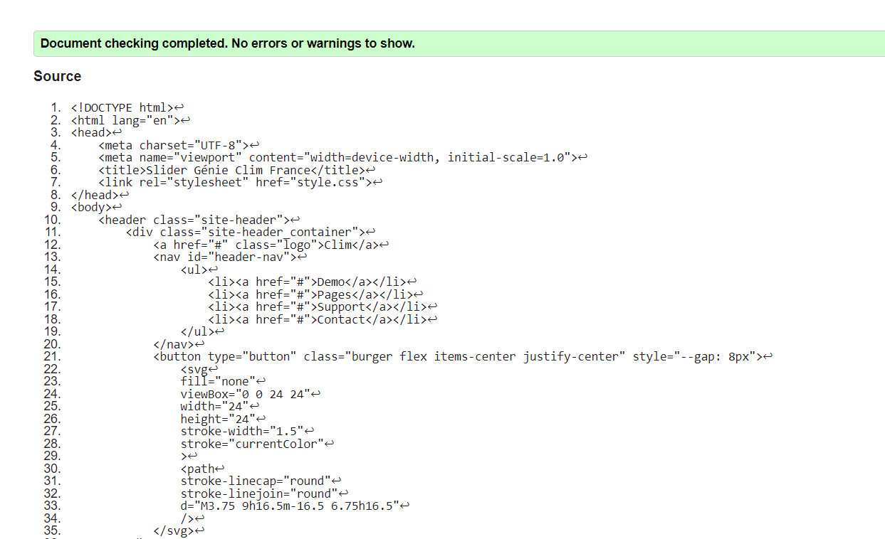

# Slider Infini

Dans à la demande de Génie Clim France, il m'as fallu de faire un carrousel qui fait tourner 5 images à l'infini,
Notamment un menu "Burger" qui sera visible en vue mobile
## Plusieurs vues 

Les vues et les tailles sont variées entre les media queries donc à vous de voir les différences 😉

Vue Mobile :

Vue Tablette :

Vue Desktop : 

Résultat du W3C Validator:

https://upload.wikimedia.org/wikipedia/commons/6/66/W3C_valid.svg
